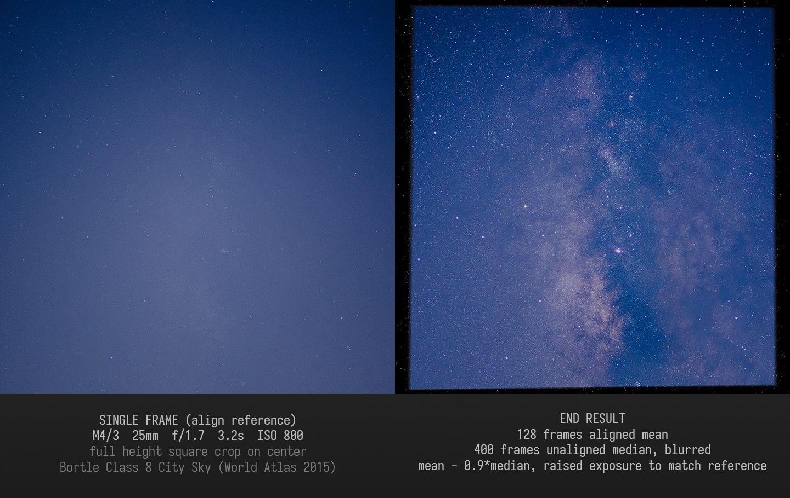

# Astrophotography Stack Align

_Technically nothing new._

## Brief Description

Align sequence of star field / astro images taken with a stationary camera (stationary relative to all those stars light years away).

See full size images under `.github/image/` folder.

## Usage

**Read the content of `main.py` to see how to use this program (really not much code, with comments).**  If you want to test different settings or is not familiar with writing codes, it is recommended to test your codes in interactive python shells like IPython or Jupyter Notebook.

Check out those jupyter notebooks under folder `math/` to see how it works.  All the processing logic is in file `image.py`, cross reference it with jupyter notebooks.

## TO-DOs

- [ ] find test samples in multiple focal length (especially wide angle)
- [ ] use actually correct workflow
  - [ ] do calibration before stacking (because stack align shifts image, so doing it after stacking is not mathematically correct)
- [ ] various `TODO`s in the code
- [ ] super resolution
- [ ] bypass demosaic
- [ ] run some stages on GPU?
- [x] increase bit precision in the pipeline
- [x] multi thread

## Dependencies

- python3
  - [`opencv`](https://docs.opencv.org/master/)
  - [`numpy`](https://numpy.org/doc/stable/)
  - [`pywt`](https://pywavelets.readthedocs.io/en/latest/) (PyWavelets)

## Acknowledgement

- Inspired by:
  1. (In Chinese) [星野摄影降噪（2）：对齐叠加 - @章佳杰 - 知乎](https://zhuanlan.zhihu.com/p/25311770)
  1. (In Chinese) [星野摄影降噪（1）：基础知识 - @章佳杰 - 知乎](https://zhuanlan.zhihu.com/p/25111196)
- Referenced:
  1. [PixInsight Reference Documentation | StarAlignment](https://pixinsight.com/doc/tools/StarAlignment/StarAlignment.html)
  1. [GitHub - LoveDaisy/star_alignment](https://github.com/LoveDaisy/star_alignment)
